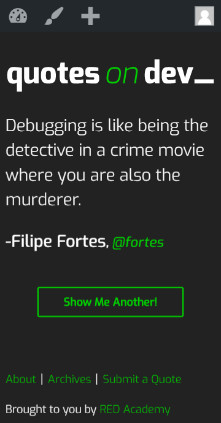
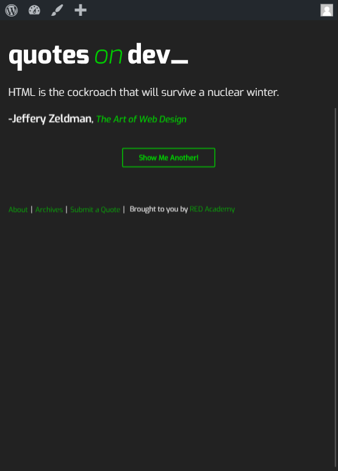
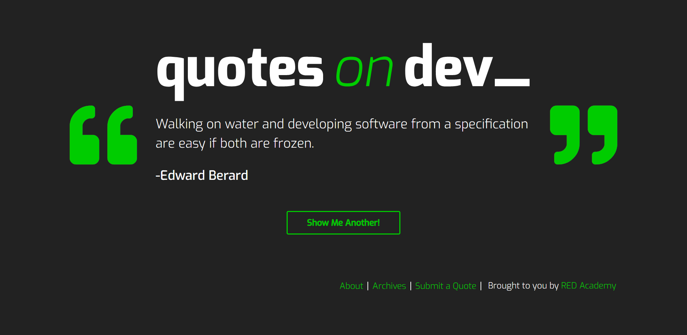
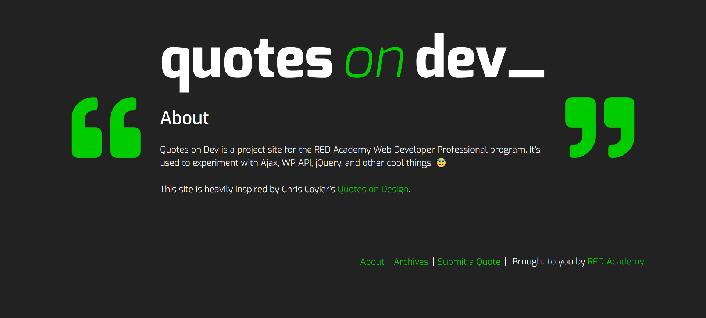
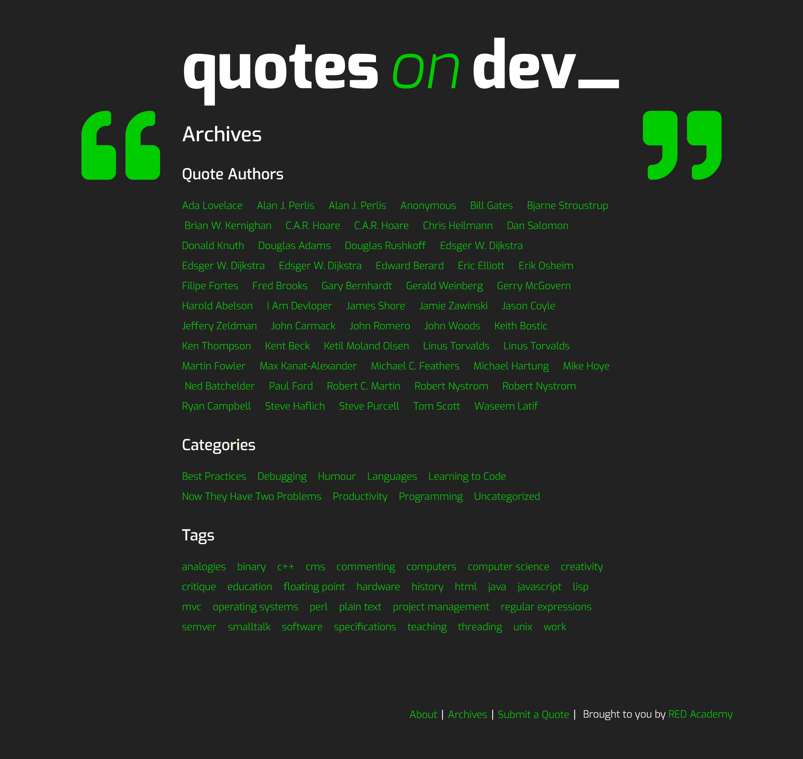
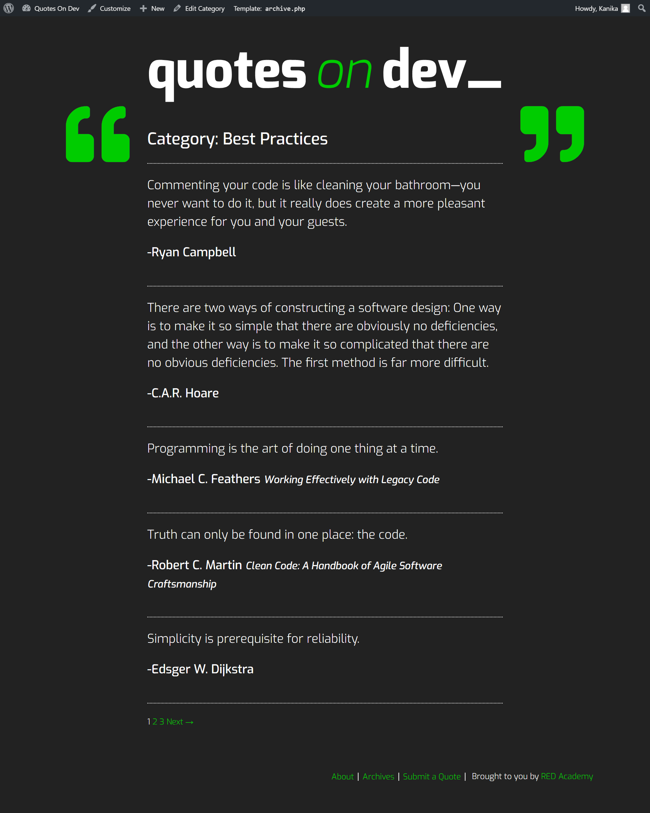
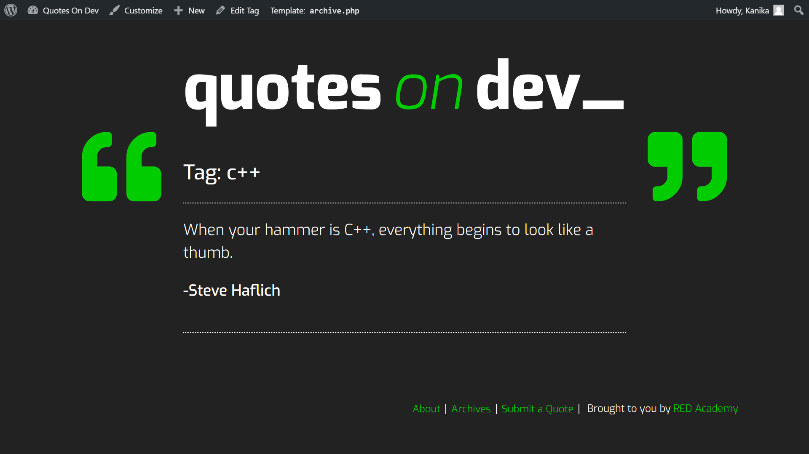
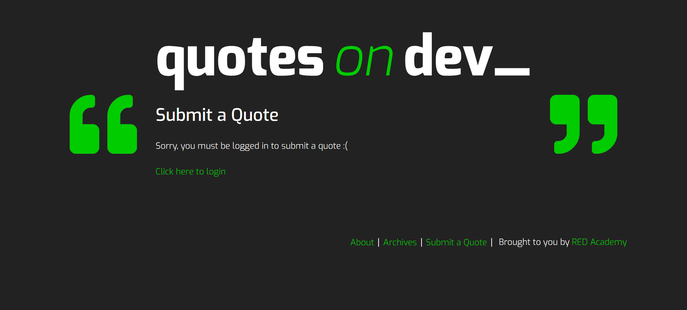
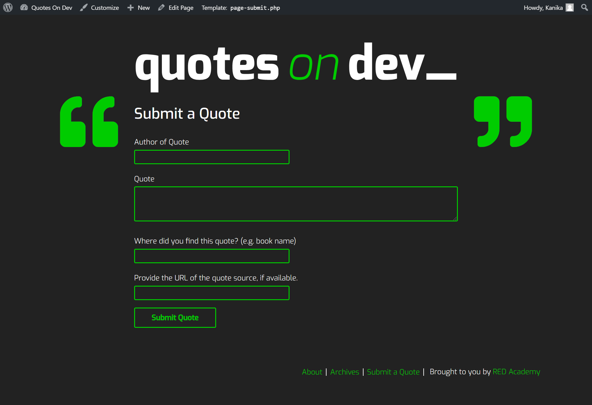
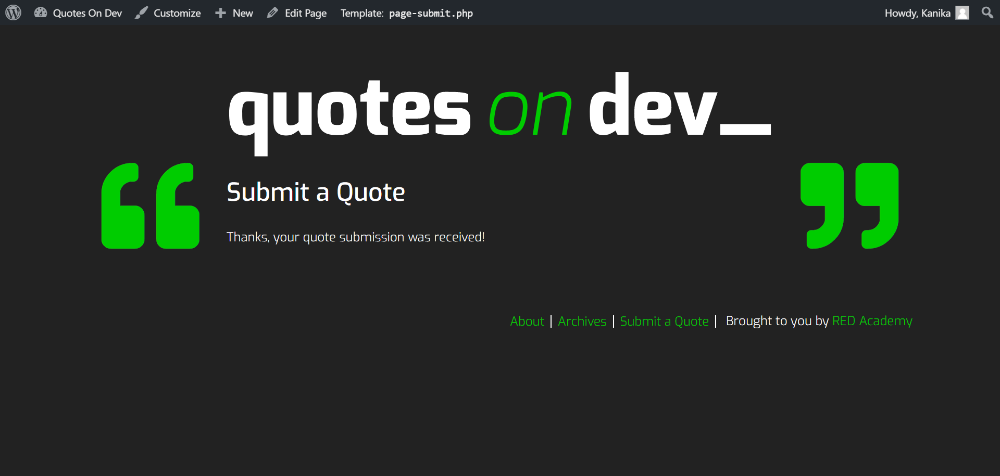

# Quotes On Dev Site

WordPress based quote generator Responsive Website, that uses a REST 'GET' API to fetch posts from the backend. In addition, a section to submit your own quotes is included and executed with the 'POST' API.

# Setup

## Install Wordpress

[Download Wordpress](https://wordpress.org) and place directory at root of server and download [MAMP](https://www.mamp.info/en/) to host your site locally.

## [Download Quotes on Dev Starter Theme](https://github.com/redacademy/quotesondev-starter)

## Quotes on Dev Starter

A WordPress starter theme for the Quotes on Dev project, forked from Underscores.

## Installation

### 1. Download me (don't clone me!)

Then add me to your `wp-content/themes` directory.

### 2. Rename the `quotesondev-starter-master` directory

Make sure that the theme directory name is project appropriate! Do you need `starter` or `master` in the directory name?

### 3. Install the dev dependencies

Next you'll need to run `npm install` **inside your theme directory** to install the npm packages you'll need for Gulp, etc.

### 4. Update the proxy in `gulpfile.js`

Lastly, be sure to update your `gulpfile.js` with the appropriate URL for the Browsersync proxy (so change `localhost[:port-here]/[your-dir-name-here]` to the appropriate localhost URL).

And now would be a good time to `git init` :)


# Technology Used

*  JavaScript

*  jQuery

*  Wordpress

*  Php

 * Saas

 * Npm

 * Gulp

 * REST Api (REpresentational State Transfer Api)


  # Glimpse of the site

  ## Mobile View
  


  ## Tablet View
  


  ## Desktop View
  

  ### About Page
  

   ### Archives Page
  

   ### Categories Page
  

  
   ### Tags Page
  

   ### Submit a Quote Page
  

  
   ### Submit a Quote Page after Login
  

  
   ### Submission Page
  

  
  #Learnings and Sample Codes

  ## Localise the scripts

  Localizing a script allows you to take data typically only accessible on the server side on your site and make it available for use in your JS. Very handy!
  - Use ``` wp_localize_script() ``` to pass data from PHP to JS

  - In ```functions.php``` add :
  ```
  function red_scripts() {
   $script_url = get_template_directory_uri() . '/scripts.js';
   wp_enqueue_script( 'jquery' );
   wp_enqueue_script( 'red_comments', $script_url, array( 'jquery' ), false, true );
  wp_localize_script( 'red_comments', 'red_vars', array(
      'rest_url' => esc_url_raw( rest_url() ),
      'wpapi_nonce' => wp_create_nonce( 'wp_rest' ),
      'post_id' => get_the_ID()
  ) );
}
add_action( 'wp_enqueue_scripts', 'red_scripts' );

   ```


  ## Javascript Code for posting a new Quote:

  ```

 //  Post request for wp/v2/posts
        $('#quote-submission-form').on('submit', function(event){
            event.preventDefault();
            let $valAuthor = $('#quote-author').val().trim().length < 1 ? null : $('#quote-author').val(),
                $valContent = $('#quote-content').val().trim().length < 1 ? null : $('#quote-content').val(),
                $valSource = $('#quote-source').val().trim().length < 1 ? null : $('#quote-source').val(),
                $valUrl = $('#quote-source-url').val().trim().length < 1 ? null : $('#quote-source-url').val();
                
            $.ajax({
                method: 'post',
                url: qod_api.rest_url + 'wp/v2/posts',
                data: {
                    'title': $valAuthor,
                    'content': $valContent,
                    '_qod_quote_source': $valSource,
                    '_qod_quote_source_url': $valUrl
                },
                beforeSend: function(xhr) {
                    xhr.setRequestHeader( 'X-WP-Nonce', qod_api.wpapi_nonce );
                }
            })
            .fail(function(err){
                console.log(err);
            })


  ```

  ## Javascript code for getting the existing quote from the json Api

  ```
     $('#new-quote-button').on('click', function(event){

            event.preventDefault();
           
             // update page variable to the current url before getting the data from wp-json
            lastPage = document.URL;

            $.ajax({
                method: 'get',
                url: qod_api.rest_url + 'wp/v2/posts?filter[orderby]=rand&filter[posts_per_page]=1'
            }).done(function(data){
            
            const post =data[0];

            const $element = $('.entry-content');
            const $content = post .content.rendered;
            const $title = $('.entry-title');
            const $author = post.title.rendered;
            let $source, $source_url;
           
            // history api to get the url slug
            const slug= post.slug;

            // add url with home-url and slug
            const url= qod_api.home_url + '/' + slug + '/';
            // update the browser url with history.pushState()
            history.pushState(null, null, url);

            $element.html( $content );
            

            if ( post._qod_quote_source && 
                 post._qod_quote_source_url ){
                    $source = post._qod_quote_source;
                    $source_url = post._qod_quote_source_url;
                    
                   
                    $title.html( `
                    — <span class="author">${$author}</span>, 
                    <span class="source">
                        <a href="${$source_url}">
                        ${$source}
                        </a>
                    </span>` );
                } else if( post._qod_quote_source ){
                    $source = post._qod_quote_source;
                    $title.html(`
                        — <span class="author">${$author}</span>, 
                        <span class="source">
                        ${$source}
                        </span>
                    `);
                   
                } else {
                    $title.html(`
                        — <span class="author">${$author}</span>
                    `);
                   
                }

            }).fail(function(err){

                console.log('error',err);
            });


  ```

## On Submission of the Quote the form animates to confirm the submission

```
  $('#quote-submission-form').slideUp(400, function(){
                    $('.quote-submission-wrapper').html('Thanks, your quote submission was received!');

```

